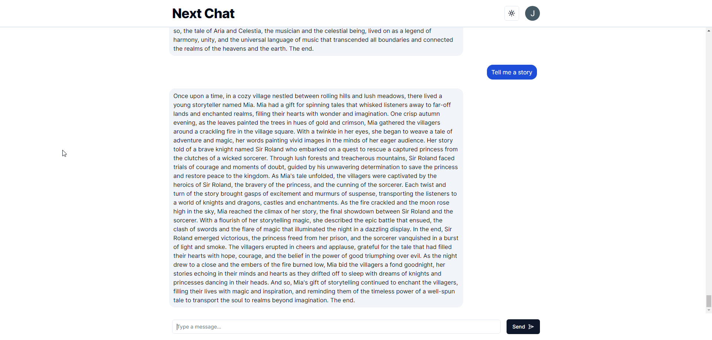

### 🚧 Under construction 🚧

# NextChat

Personal project exploring [T3 stack](https://github.com/t3-oss/create-t3-app) (NextJS, tRPC, TypeScript, Tailwind, Drizzle, NextAuth) with Open AI integration to recreate a Chat GPT-like experience

## Prerequesites

- PostgreSQL instance ([start-database.sh](start-database.sh) is available for convenience to run a docker instance of PostgreSQL)
- Obtain OAuth 2.0 credentials (follow [docs provided by NextJS](https://next-auth.js.org/providers/google) for more information/setup)
- OpenAI API Key (https://help.openai.com/en/articles/4936850-where-do-i-find-my-openai-api-key)

## Running locally

1. Create `.env` based on [.env.example](.env.example)
2. Create database name as configured in `.env` in step 1
3. Instantiate database tables by running `npm run db:push`
4. Start development server with `npm run dev` and access via `http://localhost:3000` by default

## NPM Commands

- `build`: Generates an optimized version of the application for production
- `db:generate`: Create migration script for most recent changes to the database ([schema updates](https://orm.drizzle.team/kit-docs/overview#schema-updates))
- `db:migrate`: Run migration scripts ([running migrations](https://orm.drizzle.team/kit-docs/overview#running-migrations))
- `db:push`: Directly push schema changes to the DB skipping migrations ([Prototype / Push](https://orm.drizzle.team/kit-docs/commands#prototype--push))
- `db:studio`: Runs a web interface for viewing and managing the database ([Studio](https://orm.drizzle.team/kit-docs/commands#drizzle-studio))
- `dev`: Start NextJS in development mode
- `lint`: Runs ESLint with NextJS' build in configuration
- `start`: Starts NextJS production server
